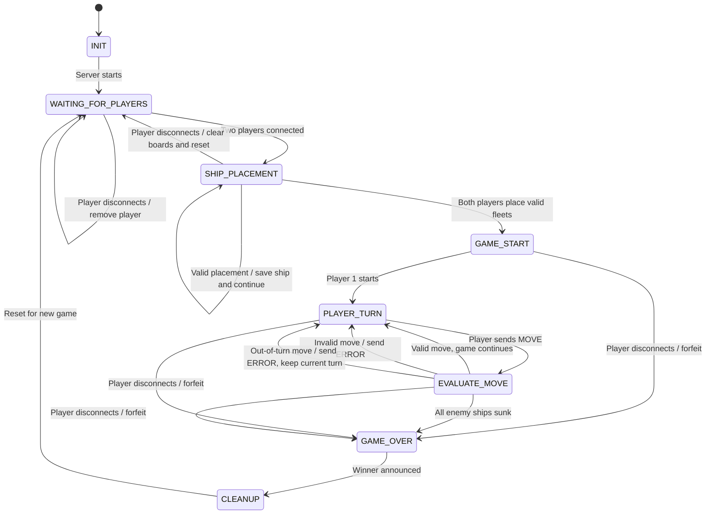

# Battleship FSM Specification

```mermaid
stateDiagram-v2
    [*] --> INIT

    INIT --> WAITING_FOR_PLAYERS : Server starts

    WAITING_FOR_PLAYERS --> SHIP_PLACEMENT : Two players connected

    WAITING_FOR_PLAYERS --> WAITING_FOR_PLAYERS : Player disconnects / remove player

    SHIP_PLACEMENT --> SHIP_PLACEMENT : Player sends PLACE_SHIP / validate placement

    SHIP_PLACEMENT --> SHIP_PLACEMENT : Invalid placement / send ERROR

    SHIP_PLACEMENT --> SHIP_PLACEMENT : Valid placement / save ship and continue

    SHIP_PLACEMENT --> GAME_START : Both players place valid fleets

    SHIP_PLACEMENT --> WAITING_FOR_PLAYERS : Player disconnects / clear boards and reset

    GAME_START --> PLAYER_TURN : Player 1 starts

    GAME_START --> GAME_OVER : Player disconnects / forfeit

    PLAYER_TURN --> EVALUATE_MOVE : Player sends MOVE

    EVALUATE_MOVE --> PLAYER_TURN : Valid move, game continues

    EVALUATE_MOVE --> PLAYER_TURN : Invalid move / send ERROR

    EVALUATE_MOVE --> PLAYER_TURN : Out-of-turn move / send ERROR, keep current turn

    EVALUATE_MOVE --> GAME_OVER : All enemy ships sunk

    PLAYER_TURN --> GAME_OVER : Player disconnects / forfeit

    EVALUATE_MOVE --> GAME_OVER : Player disconnects / forfeit

    GAME_OVER --> CLEANUP : Winner announced

    CLEANUP --> WAITING_FOR_PLAYERS : Reset for new game
```
